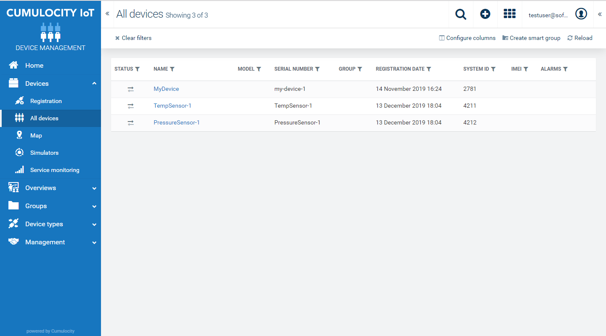
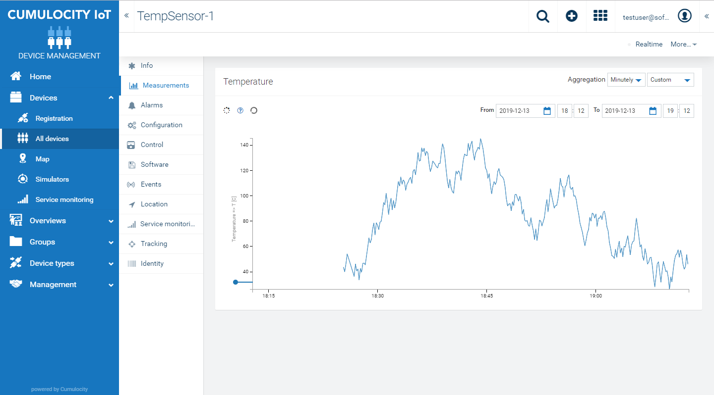

# IoT Device Simulator

This script aims to showcase how to generate measurements for Cumulocity devices.
In this example, we demonstrate necessary steps to generate simulated sensor readings through
Cumulocity's REST API.  This example automatically creates devices that host the generated readings.

If you haven't done so, please review the previous example [devicecreation](../devicecreation/readme.md) to understand how the devices in this demo script are generated.

Please refer to the [online documentation](https://cumulocity.com/guides/reference/rest-implementation) for further details on the API.


## Setup

Pre-requisites:
- Python (tested on Python 3.6+)
- 'json' and 'requests' packages installed (e.g. pip install xxx)
- Cumulocity tenant with Basic Authentication enabled and your user role allows for creation of new managed objects.
- devicecreation/IoTDeviceCreation.py script to automatically create sample devices in your tenant.

Open the IoTDeviceCreation.py script, and modify the host, name, and password.

## Running

- Run the python script though your console, ensuring the Python environment and required packages are available in the path.

```
	>> python ./IoTDeviceSimulator.py
```

This will create two new devices: one temperature sensor device and one pressure sensor device.  Note that if the devices already exist, they won't be created again.  Navigate to the 'Device Management' section of your tenant and open 'All Devices'.  You should see the new device created and registered.

 

You should also see a menu section for your devices called 'measurements'.  Select this to show the current measurements being generated for each of the devices.

 


