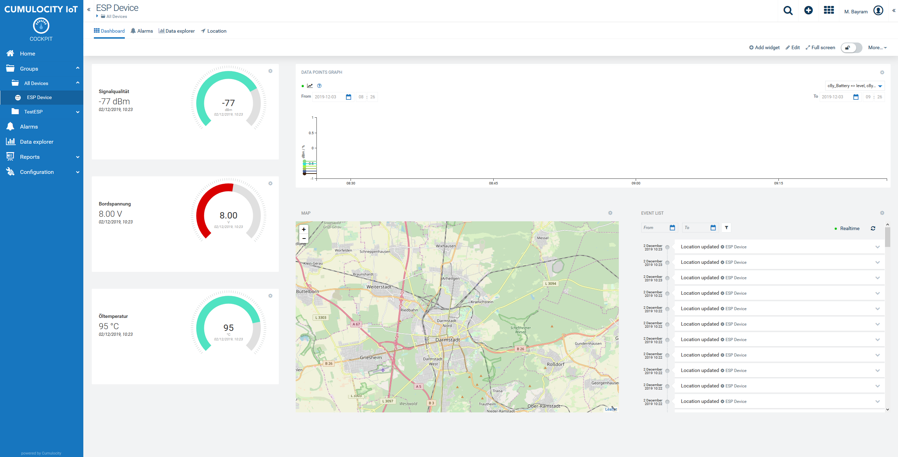
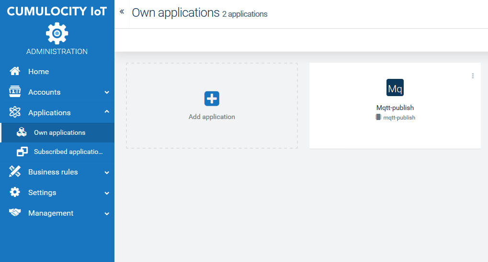
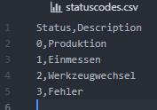
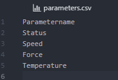
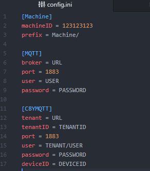

# Cumulocity Example for listening on a MQTT Broker
This is an example for listening on a MQTT Broker where machine data comes in. The messages on special topics will be parsed an translatet to the cumulcoity domain model.

See the [Domain model](https://cumulocity.com/guides/concepts/domain-model/) for further infos.

Cumulocity is an IoT platform that enables rapid connections of many, many different devices and applications. It allows you to monitor and respond to IoT data in real time and to spin up this capability in minutes. More information on Cumulocity IoT and how to start a free trial can be found [here](https://www.softwareag.cloud/site/product/cumulocity-iot.html#/).

Cumulocity IoT enables companies to to quickly and easily implement smart IoT solutions.



______________________
For more information you can Ask a Question in the [TECHcommunity Forums](http://tech.forums.softwareag.com/techjforum/forums/list.page?product=webmethods-io-b2b).

You can find additional information in the [Software AG TECHcommunity](http://techcommunity.softwareag.com/home/-/product/name/webmethods-io-b2b).
______________________

These tools are provided as-is and without warranty or support. They do not constitute part of the Software AG product suite. Users are free to use, fork and modify them, subject to the license agreement. While Software AG welcomes contributions, we cannot guarantee to include every contribution in the master project.

Contact us at [TECHcommunity](mailto:technologycommunity@softwareag.com?subject=Github/SoftwareAG) if you have any questions.

## Building application

Building requires installed and running docker.

To build .zip package simply run:

    ./build.sh

This will use our ["microservice"](https://www.cumulocity.com/guides/reference/microservice-package/) script to create docker image, add manifest file `cumulocity.json`, and pack them together as microservice application "hello-microservice.zip", which is ready to upload into cumulocity platform.

## Deploying application

To deploy packed microservice from console on running platform, use following command for "microservice" script:

    microservice deploy subscribe -n sample-microservice -d {url} -u {username} -p {password} -te {tenant}

where `{url}` is base address of the platform, and `{username}` has form `{tenant}/{user}` (eg. `management/admin`).

Deploy can be also done manually using installed cumulocity UI.



Execute the following Docker commands to build the Docker image and save it as image.tar:

```
docker build -t microservice .
```
and

```
docker save microservice > "image.tar"
```
Then pack image.tar together with the manifest cumulocity.json into a ZIP file.

```
zip microservice cumulocity.json image.tar
```

Additional information are in the documentation.

["Microservice"](https://cumulocity.com/guides/microservice-sdk/http/)

## Data structure

The idea of this datastructure is that a machine is sending all its data in a topic payload principle without taking care of the cumulocity domain model. This is for very rapid prototyping interesting in order to leave the mapping on a microservice. On top of that it is much easier to connect a machine to a MQTT Broker.

### Topic
The topic of the send data is always on the same structure. It follows:

String | Description
------------ | -------------
Prefix | Any prefix such as costumer, machine line, factory number etc.
MachineID | An identifier of the machine
Parameter | The Parameter that is send

As an example this looks for the Machine '123' of Costumer 'Example' with the Parameter 'Speed' as follows:

```
Example/123/Speed
```

Any message that is published there will be paresed through the microservice if the listner is active.

### Payload
The payload is in the format

String | Description
------------ | -------------
Value | Decimal value (separated with a decimal point, metric)
Unit | The metric unit of the value

The decimal separator for values with a fractional part is a point (.).
The unit is separated from the value with a comma (,). The unit is the corresponding metric unit of the value.
A message for the parameter Speed might thus look like:

```
100,m/s
```

### Status
Since the status is a bit special its payload looks a bit different. Since usually the status corresponds to a certain statuscode, the payload only contains of the code as value. This value will than later be looked up in a mapping file.

A message for Status might thus look like:

```
2
```

which indicated that the machine is in the state "Werkzeugwechsel".


## Code structure

The code is splittet in multiple classes. Each major function is in its own class.
Basically there are 4 major tasks:

1. Listening on a broker -> Listener class
2. If something was detectect do something -> Event class
3. The event needs to be mapped against certain values and parameters from the machine side -> Mapper
4. Result needs to be send to C8Y -> sendData

Debugger is set to Info in every module, this makes debugging a lot easier. Change if you want.

### Listener class

The Listerner class handles the MQTT listener that keeps lisenting on a MQTT broker. It connects on a configurable MQTT broker and triggers the on_message_msgs function when a message arrives on a predefined topic. In this example the listener listens on "PREFIX/MACHINEID/#". Any payload that comes via this topic will be handed over to the event class.

The MQTT Broker therefore can be hostet anywhere but needs to be reachable from machine side as well as be able to send data to cumulocity.

### Event class
The Event class handles the incoming data via topic and payload separation. In this example there are two groups of data that will be send, 'Parameters' or 'Status'.

Status is send with a value number that is mapped for a description within the 'statuscodes.csv'.
So e.g. On topic "Prefix/12345678/Status" the payload "0" arrives, this will be separated as Event message for cumulocity with the status "Produktion" in the text.

Parameter is send with value and unit. In order to check whether parameter is allowed to be send to cumulocity it is checked against the file 'parameters.csv'.
If not listed there it will be dropped.
So e.g. On topic "Prefix/123123213/Speed" the payload "100,m/s" arrives, this will be separared as measurement for cumuclocity on a static built in message with the name of the parameter "Speed" and the value "100".

### Mapper

The mapper reads the files 'parameters.csv' and 'statuscodes.csv'. They are handeles as dictonaries within the module. There are two major tasks:

1. Check whether the called parameter within an event is valid, handeld via the function checkWhetherParameterIsListed(parameter)
2. Get the text description of the send status code from the mapping file, hendeled via the function getStringfromStatusCode(status)

### sendData

The sendData modul consists of two  major classes.
One is the sending class itself in order to manage the sending of a current event.
The second one is the connector  that manages the topic, the client ID of the device and keeps the connection until data was send. The valid connector needs to be handed over to the sending class. It gets its credentials and connection data from the config file and does not require to give addtional information while creating the instance.

### Service

The service is the main module that loads and starts the listener until 'SystemExit' or 'KeyboardInterrupt' is raised.

### Status

In addition to the standard example here the output of the mapper from the parameter descirption is shown on /parameters. On a later stage this could be used to create a config interface on a webbasis.

### Statuscodes

The idea is here, that statuscodes are delivered via MQTT as a value, that represent a certain description. This mapping can be done via an excel file in the format:

Code, Descriptioon




### Parameters

The idea of the parameterfile is to have a proofing instance of which parameters will be handeled. The structure is basically only the name of the parameter.



### config

The config file is the main configuration file to adjust all the required parameters wihtin the runtime.

#### Machine
  1. machineID = Is the ID or the identifier of the machine that is also used within the topic
  2. prefix = If there is a prefix e.g. Costumer name or machine line Number etc.

#### MQTT
  1. broker = The broker the machine and the microserver connects to
  2. port = The port that is used, standart is 1883 if unsecure
  3. user = The user on the broker, keep empty if not configured
  4. password = The password on the broker, keep empty if not configured

#### C8YMQTT
  1. tenant = This is the tenant URL that should display the data
  2. tenantID = Your can get your Tenant ID from your administrator, it starts with "t", e.g. t1231231235
  3. user = Tenat User start with your ID and a backslah, followd by user, e.g. t2131324124/myuser
  4. port = In this example the unsecure 1883 port is used. We recommend to use 8883 together with SSL.
  5. password  = Password of the user
  6. deviceID = The device ID you use for the connection will be used as identifier. If the device was not created before it will be created, but with prefix "My MQTT Device".


